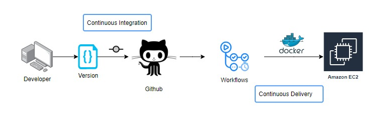

# Sensor Fault Detection Using Dockers and GitHub Actions on AWS Cloud.

### Problem Statement.
The Air Pressure System (APS) is a critical component of a heavy-duty vehicle that uses compressed air to force a piston to provide pressure to the brake pads, slowing the vehicle down. The benefits of using an APS instead of a hydraulic system are the easy availability and long-term sustainability of natural air.

In this project, the system in focus is the Air Pressure System (APS) which generates pressurized air to get utilized in various functions in a truck, such as braking and gear changes. It is a Binary Classification problem where the dataset's positive class corresponds to component failures for a specific component of the APS system. The negative class corresponds to trucks with component failures unrelated to the APS system.

The target is to reduce the cost due to unnecessary repairs. So it is required to minimize false predictions.

### Tech Stack & Infrastructure.
Before running the project, install MongoDB Compass in the local system for data storage. We also need an AWS account to access services like S3, ECR, and EC2 instances.

1. Confluent Kafka
2. MongoDB
3. Python & Machine Learning
4. FastAPI
5. Dockers
6. AWS S3, EC2, ECR
7. GitHub Actions

### Data Collection Architecture.


### Project Architecture.


### Deployment Architecture.



### Step 1: Create Virtual Environment and Install Dependency.
```bash
pip install -r requirements.txt
```

### Step 2: Create Environment Variables.
```bash
=========================================================================
Paste the following credentials as system environment variables.
=========================================================================

export AWS_ACCESS_KEY_ID=AKIAV5L47LTFW5DZVSE8
export AWS_SECRET_ACCESS_KEY=r9B+SZESA5YC0FNpCnXaUaeP3ZCXUXjer8Xl5de3
export AWS_REGION=ap-south-1
export MONGO_DB_URL=mongodb+srv://root:<password>@sensordb.8eqgr7f.mongodb.net/?retryWrites=true&w=majority
```

### Step 3: Run the Application Server.
```bash
python app.py
```

### Step 4: Train Application.
```bash
http://localhost:8080/train
```

### Step 5: Prediction Application.
```bash
http://localhost:8080/predict
```

### Step 6: AWS Deployment Steps.
1. Log in to the AWS console.
2. Create an IAM user for deployment.
    - **With specific access:**
        1. **Amazon Elastic Compute Cloud (Amazon EC2):** AWS EC2 provides scalable computing capacity in the AWS Cloud and eliminates the need to invest in hardware. Hence, we can develop and deploy applications faster. EC2 can launch as many or as few virtual servers.
        2. **Amazon Simple Storage Service (Amazon S3):** AWS S3 is a highly scalable cloud storage service that stores object data within buckets. We use an S3 bucket to store artifacts and models.
        3. **Amazon Elastic Container Registry (Amazon ECR):** AWS ECR is a container image registry service that is secure, scalable, and reliable. ECR supports private repositories with resource-based permissions. We use CLI to push, pull, and manage Docker images inside ECR.
    - **Description: About the deployment.**
        1. Build a Docker image of the source code.
        2. Push the Docker image to AWS ECR.
        3. Launch the AWS EC2 instance.
        4. Pull the Docker image from ECR to EC2.
        5. Launch the Docker image inside AWS EC2.
    - **Policy:**
        1. AmazonEC2ContainerRegistryFullAccess
	    2. AmazonEC2FullAccess
	    3. AmazonS3FullAccess

3. Create an S3 bucket in **ap-south-1**.
4. ECR repo to store/save the docker image.
5. Create an EC2 virtual machine with Ubuntu OS.
6. Open EC2 and install Dockers in the EC2 machine.
    ```bash
    sudo apt-get update && sudo apt-get upgrade -y

    curl -fsSL https://get.docker.com -o get-docker.sh
	sudo sh get-docker.sh
	sudo usermod -aG docker ubuntu
	newgrp docker
    ```
7. Configure EC2 as a self-hosted runner.

    ``` setting > actions > runner > new self hosted runner > choose os > then run command one by one ```

8. Setup GitHub Actions Secrets.
    ```bash
    =========================================================================
    Paste the following credentials as GitHub Actions Secrets.
    =========================================================================

    AWS_ACCESS_KEY_ID=AKIAV5L47LTFW5DZVSE8
    AWS_SECRET_ACCESS_KEY=r9B+SZESA5YC0FNpCnXaUaeP3ZCXUXjer8Xl5de3
    AWS_REGION=ap-south-1
    AWS_ECR_LOGIN_URI=416648927154.dkr.ecr.ap-south-1.amazonaws.com
    ECR_REPOSITORY_NAME=sensor-aps-registry
    MONGO_DB_URL=mongodb+srv://root:<password>@sensordb.8eqgr7f.mongodb.net/?retryWrites=true&w=majority
    ```

## Authors

- [Aritra Ganguly](https://in.linkedin.com/in/gangulyaritra)

## License & Copyright

© 2022 Aritra Ganguly, iNeuron.ai

Licensed under the [MIT License](LICENSE).
